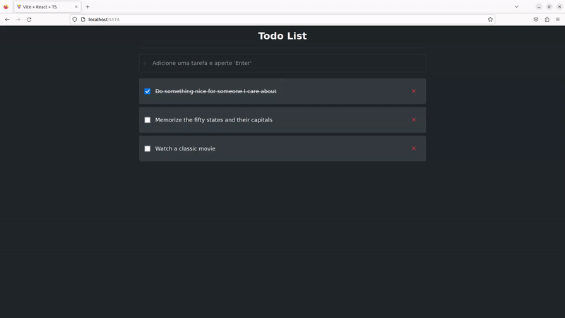

# Todo List

## Demonstração

## Tecnologias utilizadas

-   ReactJS
-   React Hooks (useState, useEffect, useContext)
-   Typescript
-   Javascript
-   HTML5
-   CSS3
-   Styled-components
-   Axios
-   React-Toastify
-   DummyJSON ( Para consumo de API )

## Pré-requisitos

Antes de começar, você vai precisar ter instalado em sua máquina as seguintes ferramentas: Git, NodeJs (>= 18.15.0).

## Rodando o Projeto

Clone o repositório

    git clone https://github.com/ander0308/todo-list-typescript

Acesse a pasta do repositório

    cd todo-typescript

Instale todas as dependências utilizando os comandos

    yarn ou npm install
    yarn dev ou npm run dev

Agora você pode acessar o servidor em [http://localhost:5174/](http://localhost:5174/)

## Autor

<a href="https://ander0308.github.io/">
 
  

Feito com ❤️ por <a href="https://ander0308.github.io/" title="Anderson Santana">Anderson Santana</a> 👋🏽 Entre em contato!

   

## 📝 Licença

Este projeto esta sobe a licença [MIT](./LICENSE).
